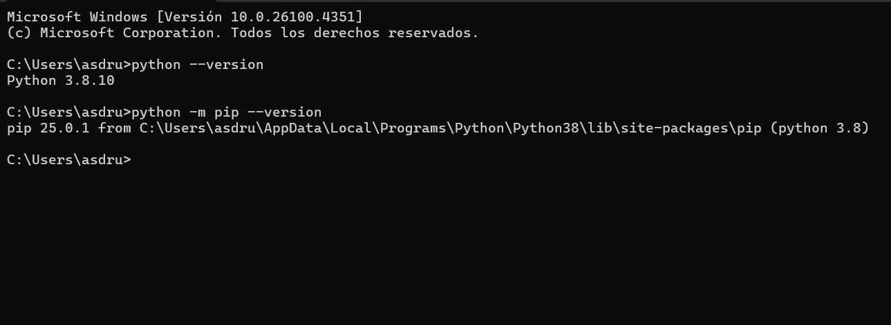
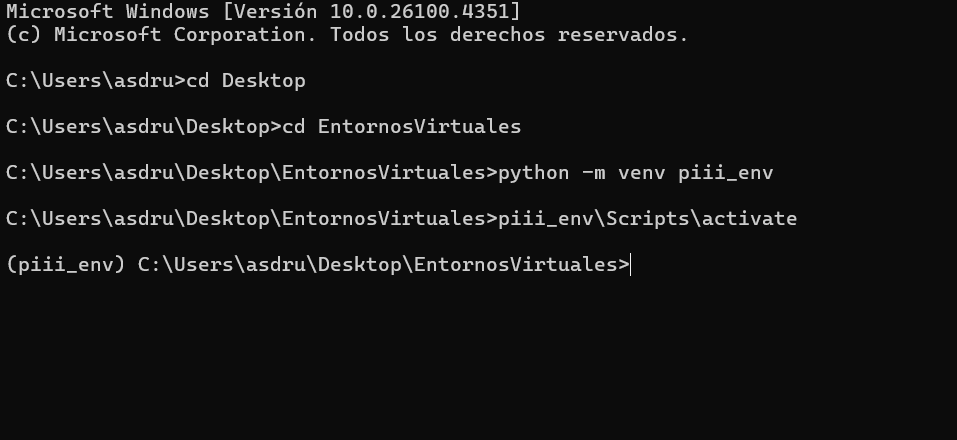
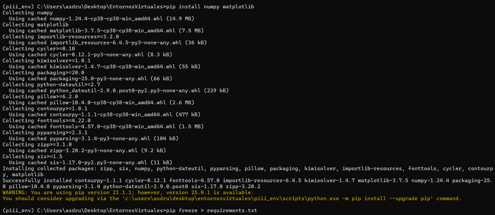
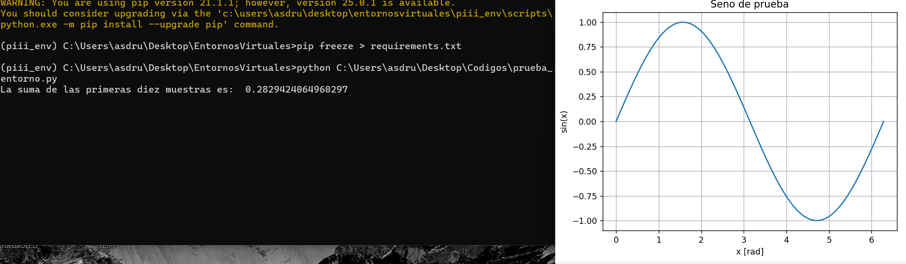
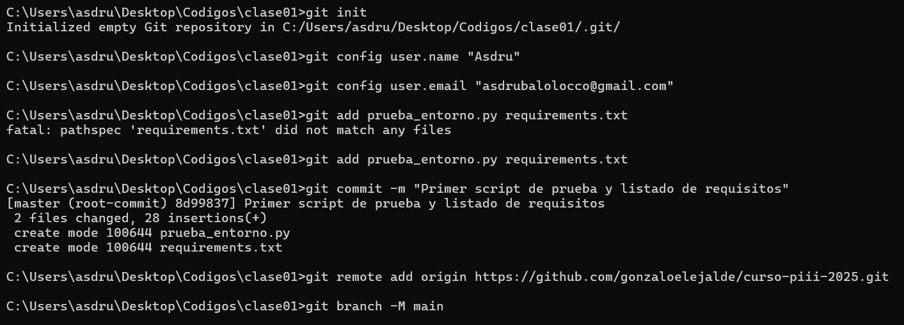
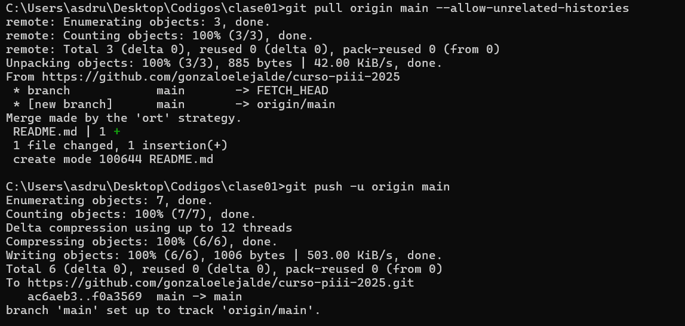
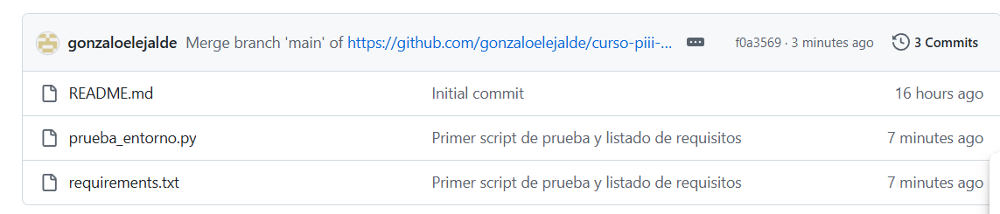

# Proyecto: Clase01

# 1. Instalacion de Python

Instale y verifique la version de python

# 2. Configurar entorno virtual

Cree la carpeta, el entorno y lo active

# 3. Bibliotecas

Instale numpy y matplotlib y las añadi a un archivo de txt 

# 4. Script de prueba

Cree el script en vsc y lo ejecute desde la consola dentro del entorno virtual

# 5. Git

Instale e inicie Git dentro de la carpeta donde estan los archivos y conecte el repositorio local con el remoto

